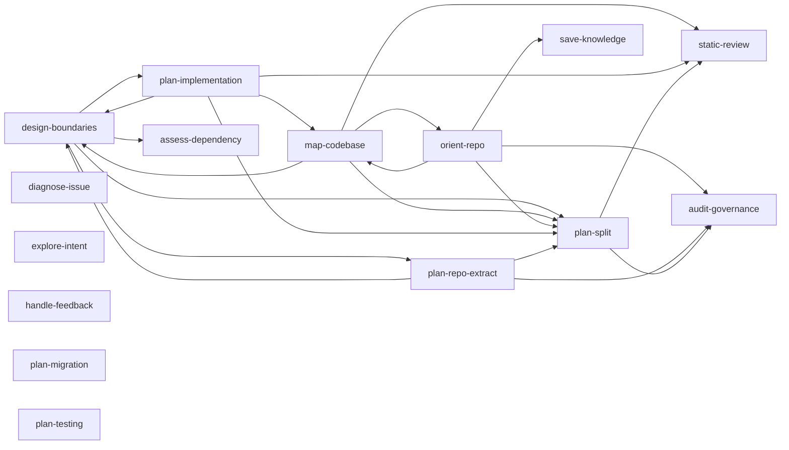
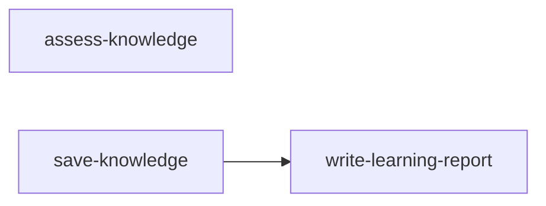
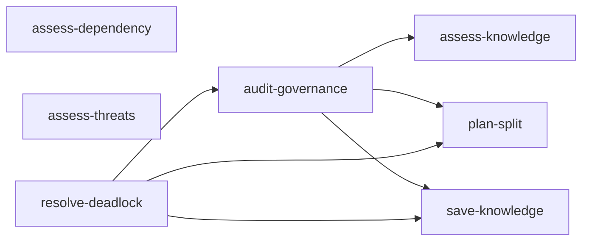
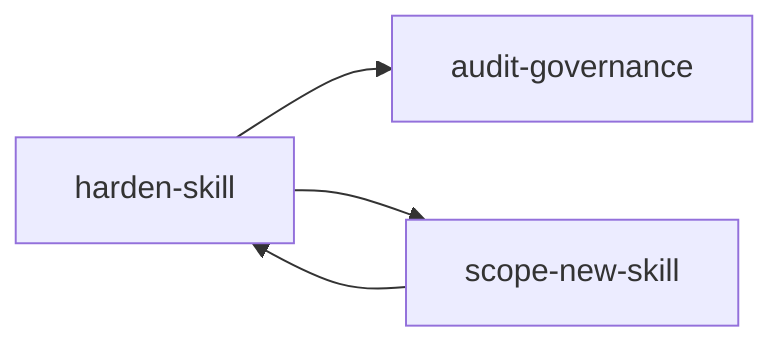

# Fornax

**Skills that plan before they touch your code** — portable, single-purpose skills that orient,
plan, map, and review, but never edit behind your back.

Fornax is a portable, multi-agent **skills registry**. Each skill is a small
operation you apply to a codebase or a conversation to get one well-defined result — a plan, a map,
a review, a decision, or a clarified intent. Skills **read / plan / report** rather than edit, so an
agent can reason with them safely *before* it changes anything.

Works across Claude Code, Codex, Cursor, Antigravity, and generic LLM agents. Installed as a Claude
Code plugin, skills are namespaced under the brand: `/fornax:<skill>`.

Each skill refines the **context** an agent holds — it separates and reorganizes what is there and
never fabricates what is not, which is why it reports rather than edits. See
[docs/identity.md](docs/identity.md) for the full thesis and naming rationale;
[PROJECT.md](PROJECT.md) for standing decisions and non-goals; and [AGENTS.md](AGENTS.md) for
authoring, versioning, and review rules.

## The pipeline

The codebase skills form one continuous arc — each stage hands off to the next:

```text
explore-intent → orient-repo → map-codebase → design-boundaries → plan-implementation → plan-split / plan-repo-extract → static-review
   explore          orient       understand         design               plan                    restructure               review
  (what/why)     (governance)   (how it works)    (boundaries)         (the work)               (split/extract)          (quality)
```

The slugs are task-descriptive and say what each skill does.

## Skills

Grouped by `family` (see [docs/identity.md](docs/identity.md) and the skill maps below).

**Implementation** — codebase work; produce a plan or report, do not edit code

- [`explore-intent`](skills/explore-intent/) — explore intent and options through dialogue before building (a stance).
- [`orient-repo`](skills/orient-repo/) — orient in an unfamiliar repo before acting, as a working brief.
- [`map-codebase`](skills/map-codebase/) — map how an unfamiliar codebase or subsystem works.
- [`design-boundaries`](skills/design-boundaries/) — design component boundaries before the code exists.
- [`diagnose-issue`](skills/diagnose-issue/) — statically trace control and data flow to infer the root cause.
- [`plan-implementation`](skills/plan-implementation/) — turn a goal into an ordered, verifiable implementation plan.
- [`plan-testing`](skills/plan-testing/) — design a comprehensive test strategy for a feature or refactor.
- [`plan-migration`](skills/plan-migration/) — plan a safe data migration or database schema change.
- [`plan-split`](skills/plan-split/) — plan splitting a large or tangled code unit in place.
- [`plan-repo-extract`](skills/plan-repo-extract/) — assess extracting a component into its own repository.
- [`static-review`](skills/static-review/) — local, gate-based static code review.
- [`handle-feedback`](skills/handle-feedback/) — handle code-review feedback with rigor, not performative agreement (a stance).

**Knowledge** — capture and shape conversation knowledge

- [`assess-knowledge`](skills/assess-knowledge/) — assess a conversation for knowledge worth extracting.
- [`write-learning-report`](skills/write-learning-report/) — turn mature conversation content into a learning report.
- [`save-knowledge`](skills/save-knowledge/) — persist conversation knowledge into durable project, agent, or team sources.

**Decisions & governance** — project-level judgment calls

- [`assess-dependency`](skills/assess-dependency/) — decide whether to adopt a structural dependency.
- [`assess-threats`](skills/assess-threats/) — identify trust boundaries and potential security vulnerabilities.
- [`audit-governance`](skills/audit-governance/) — test governance prose against what the project actually enforces.
- [`resolve-deadlock`](skills/resolve-deadlock/) — resolve conflicting requirements or a governance deadlock.

**Meta** — skills about the toolkit itself

- [`scope-new-skill`](skills/scope-new-skill/) — explore whether a workflow should become a skill.
- [`harden-skill`](skills/harden-skill/) — harden a skill's instructions so the wording reliably changes behavior.

## Skill maps

Per-domain handoff graphs, generated from each skill's `family` and its `SKILL.md` handoffs by
[scripts/skill_graph.py](scripts/skill_graph.py) — regenerate after changing handoffs. An edge that
crosses into another domain is a hand-off to that domain's skills.

<!-- SKILL-MAPS:START (generated by scripts/skill_graph.py — do not edit by hand) -->

### Implementation



### Knowledge



### Decisions & governance



### Meta (skills about the toolkit)



<!-- SKILL-MAPS:END -->

## Design principles

- **Portable first.** Stable workflow in `SKILL.md`, vendor-neutral manifest in `skill.yaml`. Skills
  are host-neutral; host-specific discovery and install live at the packaging layer (root plugin
  manifests), not per skill. Copy or vendor a skill folder without rewriting paths.
- **Read / plan / report.** Skills produce plans, maps, and reviews and hand off execution — they do
  not edit code or change state behind the user's back.
- **Task-descriptive names.** Slugs say what the skill does; triggering rides the `description`, and
  the `/fornax:` prefix adds a second layer of collision safety against built-ins.

## Layout

```text
distribution.json       # canonical distribution identity and release version
skills/<skill-name>/
  skill.yaml            # portable discovery manifest
  SKILL.md              # portable workflow (entrypoint)
  references/           # detail loaded on demand
.claude-plugin/         # Claude Code plugin manifest (drives the /fornax: prefix)
templates/skill/        # starting point for a new skill
scripts/validate_skills.py
```

## Install

Every `SKILL.md` follows the open [Agent Skills](https://agentskills.io) standard, so the skills run
across many hosts. Treat each `skills/<skill-name>/` folder as the portable package boundary; see
[docs/host-packaging.md](docs/host-packaging.md) for per-host details.

To deploy the tagged release through one provenance-aware workflow without installing a permanent
CLI command:

```sh
pipx run \
  --spec "git+https://github.com/tacticaldoll/fornax.git@v0.1.0#subdirectory=tools/fornax-cli" \
  fornax deploy --all
```

Persistent `pipx` installation and the equivalent `uvx` command are documented in
[`tools/fornax-cli`](tools/fornax-cli/). Both execute the same formal release pipeline; neither
accepts a local source checkout.

- **Claude Code** — install as a plugin (`.claude-plugin/`); skills appear as `/fornax:<skill>`.
- **Codex / Cursor** — install as a plugin (`.codex-plugin/`, `.cursor-plugin/`).
- **OpenCode** — add `fornax@git+https://github.com/tacticaldoll/fornax.git` to `opencode.json`
  (see [.opencode/INSTALL.md](.opencode/INSTALL.md)).
- **Gemini CLI / Antigravity** — install as an extension (`gemini-extension.json`) from the Git
  repository URL (both use `~/.gemini/extensions/`).
- **GitHub Copilot CLI / Cline** — open-standard discovery: place skill folders in `.github/skills`,
  `.agents/skills`, `.cline/skills`, `~/.copilot/skills`, or `~/.cline/skills` as appropriate.
- **Git-based installers** — `gh skill`, `npx skills`, or `shskills` against this repo.

## Add a skill

Copy `templates/skill/` into `skills/<skill-name>/` and replace the placeholders. Write `skill.yaml`
first (discovery metadata), then `SKILL.md` (the portable workflow). Use
[docs/skill-types.md](docs/skill-types.md) to pick the dominant type,
[docs/skill-yaml-schema.md](docs/skill-yaml-schema.md) for the manifest, and
[docs/host-packaging.md](docs/host-packaging.md) for how host-specifics are packaged.

## Validate

```sh
python3 scripts/validate_skills.py
```

Run this before installing, publishing, or copying skills. After changing `templates/skill`, also
run `python3 scripts/validate_skills.py --skills-path templates --allow-template-placeholders`.

## License

MIT — see [LICENSE](LICENSE).
